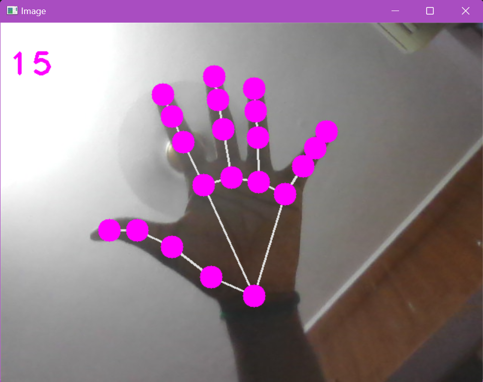
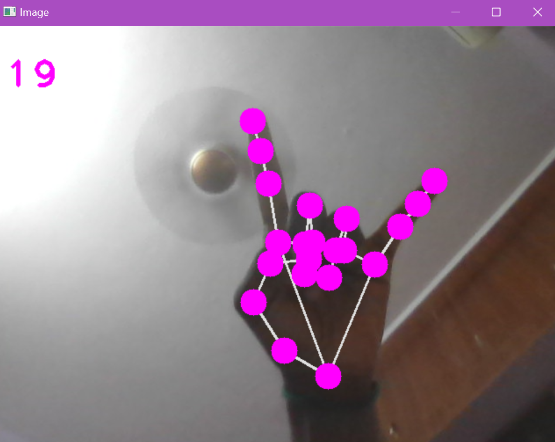

# Real-time Hand Tracking with MediaPipe and OpenCV

This project showcases real-time hand tracking using MediaPipe and OpenCV. Leveraging computer vision, it accurately detects and annotates hand landmarks from webcam footage, offering insights into hand poses and gestures.

